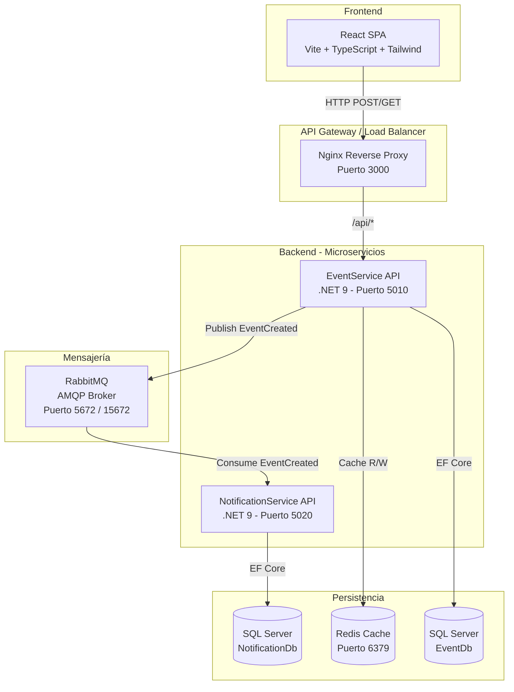
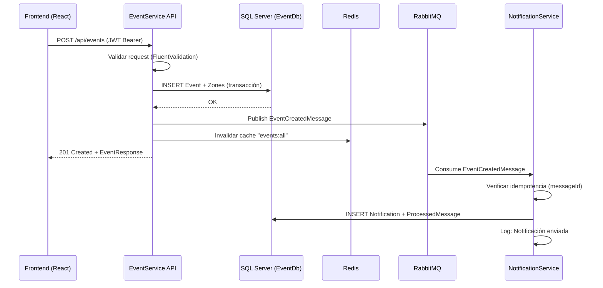

# Arquitectura — Plataforma de Eventos MVP

## 1. Diagrama de Arquitectura General



## 2. Diagrama de Flujo: Crear Evento



## 3. Listado de Microservicios

### EventService API (Puerto 5010)
- **Responsabilidad**: CRUD de eventos y zonas
- **Endpoints**:
  - `POST /api/events` — Crear evento con zonas (requiere JWT)
  - `GET /api/events` — Listar eventos (con cache Redis, público)
  - `GET /api/events/{id}` — Detalle de evento (público)
- **BD**: SQL Server (`EventDb`)
- **Cache**: Redis (TTL 5 min para listado)
- **Mensajería**: Publica `EventCreatedMessage` a RabbitMQ vía MassTransit
- **Arquitectura**: Clean Architecture + DDD + CQRS (MediatR)

### NotificationService API (Puerto 5020)
- **Responsabilidad**: Consumir eventos de mensajería y registrar notificaciones
- **Endpoints**:
  - `GET /api/notifications` — Listar notificaciones enviadas
- **BD**: SQL Server (`NotificationDb`)
- **Mensajería**: Consume `EventCreatedMessage` con idempotencia
- **Idempotencia**: Tabla `ProcessedMessages` para evitar duplicados por `messageId`

## 4. Stack Tecnológico

| Capa | Tecnología |
|------|-----------|
| Backend Framework | .NET 9 |
| ORM | Entity Framework Core 9 |
| CQRS | MediatR 12 |
| Validación | FluentValidation 11 |
| Mensajería | MassTransit 8 + RabbitMQ |
| Cache | StackExchange.Redis |
| BD SQL | SQL Server 2022 |
| Frontend | React 19 + TypeScript + Vite |
| Estilos | Tailwind CSS 4 |
| Contenedores | Docker + Docker Compose |

## 5. Patrones y Principios Aplicados

- **Clean Architecture**: Separación estricta en Domain, Application, Infrastructure y API layers
- **Domain-Driven Design (DDD)**: Entidades ricas con lógica de negocio (Event como Aggregate Root, Zone como entidad hija)
- **CQRS**: Separación de Commands (escritura) y Queries (lectura) mediante MediatR
- **Event-Driven Architecture**: Comunicación asíncrona entre microservicios vía RabbitMQ/MassTransit
- **Idempotent Consumer**: NotificationService verifica `messageId` antes de procesar para evitar duplicados
- **Cache-Aside Pattern**: Redis como cache en lectura, invalidado en escritura
- **Database per Service**: Cada microservicio tiene su propia base de datos
- **Dependency Inversion**: Interfaces en Application/Domain, implementaciones en Infrastructure

## 6. Flujos de Comunicación

### Síncrono (HTTP)
- Frontend → EventService: REST API con JWT Bearer token
- Frontend → NotificationService: REST API (consulta de notificaciones)

### Asíncrono (Mensajería)
- EventService → RabbitMQ → NotificationService: Mensaje `EventCreatedMessage`
- Formato del mensaje:
```json
{
  "messageId": "uuid",
  "eventId": "uuid",
  "name": "string",
  "occurredAt": "ISO-8601",
  "correlationId": "uuid",
  "version": 1
}
```

## 7. Seguridad

- **Autenticación**: JWT Bearer Token (HMAC-SHA256)
  - Issuer: `EventPlatform`
  - Audience: `EventPlatformClient`
  - Para el MVP se usa un token fijo de demo
- **Autorización**: Endpoints de escritura requieren token válido; lectura es pública
- **CORS**: Configurado para permitir solo orígenes del frontend
- **Comunicación interna**: Los microservicios se comunican vía RabbitMQ (no expuesto externamente)
- **Secrets**: En producción se usarían AWS Secrets Manager o Azure Key Vault

## 8. Consideraciones para Producción (Evolución)

- **API Gateway**: Agregar Kong, AWS API Gateway o YARP para routing centralizado
- **Service Discovery**: Consul o AWS Cloud Map
- **Observabilidad**: OpenTelemetry + Grafana/Loki/Tempo para métricas, logs y traces
- **CI/CD**: GitHub Actions o AWS CodePipeline
- **Escalabilidad**: Kubernetes (EKS) o AWS ECS Fargate para auto-scaling
- **Seguridad avanzada**: Keycloak/Cognito para OAuth 2.0 + OIDC con roles granulares
- **BD NoSQL**: MongoDB/DynamoDB para búsqueda avanzada de eventos (search index)
- **Antifraude**: Integración con proveedores de PSP y reglas de negocio

## 9. Sustentación de Decisiones

- **SQL Server**: Robusto, excelente integración con EF Core, soporte empresarial, compatible con Azure SQL y AWS RDS
- **MassTransit sobre raw RabbitMQ**: Abstrae la complejidad del broker, facilita retry policies, saga, y cambio de transporte
- **MediatR para CQRS**: Desacopla handlers de controllers, facilita testing y pipeline behaviors
- **Redis para cache**: Alto rendimiento, bajo latencia, ideal para lecturas frecuentes
- **Vite sobre CRA**: Build más rápido, HMR instantáneo, menor bundle size
- **Clean Architecture**: Permite evolucionar cada capa independientemente y facilita testing
